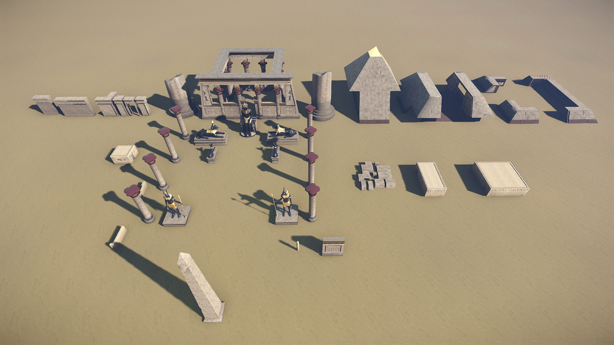
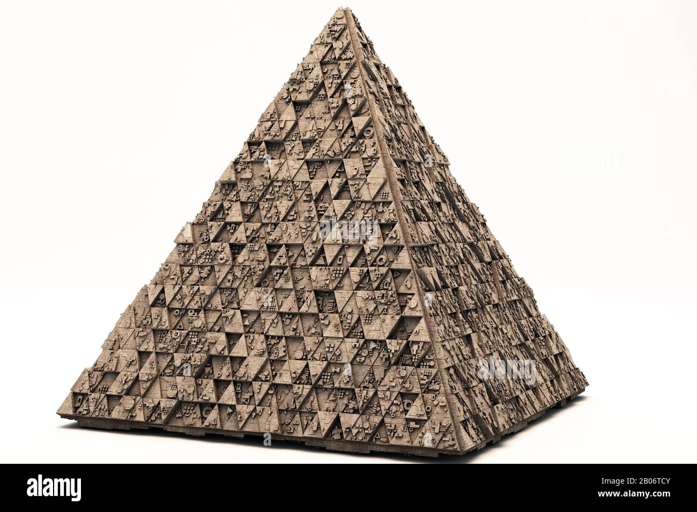
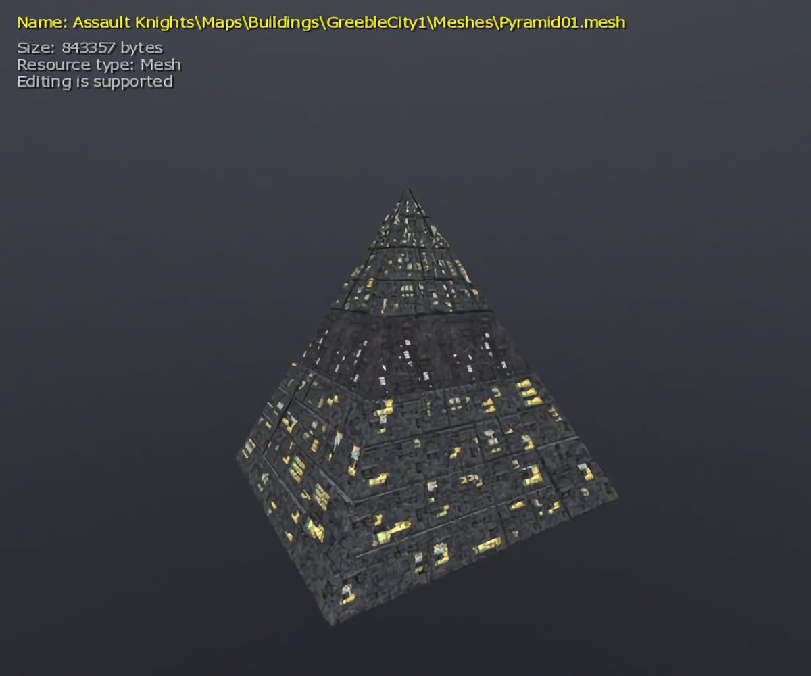

# Final Project!

This is it! The culmination of your procedural graphics experience this semester. For your final project, we'd like to give you the time and space to explore a topic of your choosing. You may choose any topic you please, so long as you vet the topic and scope with an instructor or TA. We've provided some suggestions below. The scope of your project should be roughly 1.5 homework assignments). To help structure your time, we're breaking down the project into 4 milestones:

## Project planning: Design Doc (due 11/9)
Before submitting your first milestone, _you must get your project idea and scope approved by Rachel, Adam or a TA._

### Design Doc
Start off by forking this repository. In your README, write a design doc to outline your project goals and implementation plan. It must include the following sections:

#### Introduction
- I have always been interested in the lore, theocracy, language, and most importantly distinctive artic style of the civilization that thrived on the banks of the Nile Millenia ago: Ancient Egypt. I had a few ideas of how I might apply my interest in this theme in the realm of proceduralism. 

#### Goal
- Design a greeble generator both:
 
	1) designed to work well on a few specific types of themed structure geometry. 
	2) consisting themselves at least partially of recognizable Egyptian themes. 

#### Inspiration/reference:
- In reference to goal #1, these will probably have minimal or no procedural elements. Perhaps a few different base dimensions or heights, or if short on time, the buildings will be completely hand defined. Their shapes are usually relatively simple to model. See a few examples of common structures in this image. In the scope of this project I would probably start with the obelisk or pyramid shapes, possible exploring the larger temple styles if time permits.

- The main goal is #2, that is, generating greebles to fit properly and look pleasant on the surfaces of these structures. I found a few inspiration images for this technique online. The first demonstrates height based greebles divided into a triangle mesh. The second demonstrates the possibility for building lighting on a themed structure.

#### Specification:
- For greebles
  - be able to select a surface partition type, square or triangle? 
  - be able to select a scale for the "noise"
  - be able to select some kind of mix ratio between generic geometric shapes (i.e. "star wars" greebles) and themed shapes, such as extruded hieroglyphs
- For structures
  - be able to choose from one or more pre-defined stereotypical building styles
  - (time permitting) be able to apply some kind of noise to generate variants of the chosen building shape

#### Techniques:
- [Procedural Greeble Tutorial](https://lindenreidblog.com/2017/12/13/procedural-greeble-tutorial/) by [Linden Reid](https://lindenreidblog.com/)

In this tutorial, Linden introduces how he did the greeble effects. Put simply, to extrude a poly, we can create new verticies by translating the old verticies in the direction of the surface normal. 

For more realistic effects, we can add randomness to the extrusion scale and whether or not greeble is applied. 

- [Voronoi Greeble Displacement: ShaderToy](https://www.shadertoy.com/view/NllyWf) by Shane

In this shadertoy, Shane used a tailored Voronoi algorithm to drive the generation of greeble displacement.  

#### Design:

The scene will consist of two main component, a background scene and a foreground geometry powered by greeble.

#### Timeline:

|  | San Jewell | Yilin Liu |
| --------------- | --------------- | --------------- |
| Milestone 1, 11/16| General Greeble Generation & Look Design | General Greeble Generation & Look Design |
| Milestone 2, 11/28| Animated Greeble Generation | Procedural Background & Sound |
| Milestone 3, 12/5 | Optimization | Color Tuning |

Submit your Design doc as usual via pull request against this repository.
## Milestone 1: Implementation part 1 (due 11/16)
Begin implementing your engine! Don't worry too much about polish or parameter tuning -- this week is about getting together the bulk of your generator implemented. By the end of the week, even if your visuals are crude, the majority of your generator's functionality should be done.

Put all your code in your forked repository.

Submission: Add a new section to your README titled: Milestone #1, which should include
- written description of progress on your project goals. If you haven't hit all your goals, what's giving you trouble?
- Examples of your generators output so far
We'll check your repository for updates. No need to create a new pull request.
## Milestone 3: Implementation part 2 (due 11/28)
We're over halfway there! This week should be about fixing bugs and extending the core of your generator. Make sure by the end of this week _your generator works and is feature complete._ Any core engine features that don't make it in this week should be cut! Don't worry if you haven't managed to exactly hit your goals. We're more interested in seeing proof of your development effort than knowing your planned everything perfectly. 

Put all your code in your forked repository.

Submission: Add a new section to your README titled: Milestone #3, which should include
- written description of progress on your project goals. If you haven't hit all your goals, what did you have to cut and why? 
- Detailed output from your generator, images, video, etc.
We'll check your repository for updates. No need to create a new pull request.

Come to class on the due date with a WORKING COPY of your project. We'll be spending time in class critiquing and reviewing your work so far.

## Final submission (due 12/5)
Time to polish! Spen this last week of your project using your generator to produce beautiful output. Add textures, tune parameters, play with colors, play with camera animation. Take the feedback from class critques and use it to take your project to the next level.

Submission:
- Push all your code / files to your repository
- Come to class ready to present your finished project
- Update your README with two sections 
  - final results with images and a live demo if possible
  - post mortem: how did your project go overall? Did you accomplish your goals? Did you have to pivot?

## Topic Suggestions

### Create a generator in Houdini

### A CLASSIC 4K DEMO
- In the spirit of the demo scene, create an animation that fits into a 4k executable that runs in real-time. Feel free to take inspiration from the many existing demos. Focus on efficiency and elegance in your implementation.
- Example: 
  - [cdak by Quite & orange](https://www.youtube.com/watch?v=RCh3Q08HMfs&list=PLA5E2FF8E143DA58C)

### A RE-IMPLEMENTATION
- Take an academic paper or other pre-existing project and implement it, or a portion of it.
- Examples:
  - [2D Wavefunction Collapse Pokémon Town](https://gurtd.github.io/566-final-project/)
  - [3D Wavefunction Collapse Dungeon Generator](https://github.com/whaoran0718/3dDungeonGeneration)
  - [Reaction Diffusion](https://github.com/charlesliwang/Reaction-Diffusion)
  - [WebGL Erosion](https://github.com/LanLou123/Webgl-Erosion)
  - [Particle Waterfall](https://github.com/chloele33/particle-waterfall)
  - [Voxelized Bread](https://github.com/ChiantiYZY/566-final)

### A FORGERY
Taking inspiration from a particular natural phenomenon or distinctive set of visuals, implement a detailed, procedural recreation of that aesthetic. This includes modeling, texturing and object placement within your scene. Does not need to be real-time. Focus on detail and visual accuracy in your implementation.
- Examples:
  - [The Shrines](https://github.com/byumjin/The-Shrines)
  - [Watercolor Shader](https://github.com/gracelgilbert/watercolor-stylization)
  - [Sunset Beach](https://github.com/HanmingZhang/homework-final)
  - [Sky Whales](https://github.com/WanruZhao/CIS566FinalProject)
  - [Snail](https://www.shadertoy.com/view/ld3Gz2)
  - [Journey](https://www.shadertoy.com/view/ldlcRf)
  - [Big Hero 6 Wormhole](https://2.bp.blogspot.com/-R-6AN2cWjwg/VTyIzIQSQfI/AAAAAAAABLA/GC0yzzz4wHw/s1600/big-hero-6-disneyscreencaps.com-10092.jpg)

### A GAME LEVEL
- Like generations of game makers before us, create a game which generates an navigable environment (eg. a roguelike dungeon, platforms) and some sort of goal or conflict (eg. enemy agents to avoid or items to collect). Aim to create an experience that will challenge players and vary noticeably in different playthroughs, whether that means procedural dungeon generation, careful resource management or an interesting AI model. Focus on designing a system that is capable of generating complex challenges and goals.
- Examples:
  - [Rhythm-based Mario Platformer](https://github.com/sgalban/platformer-gen-2D)
  - [Pokémon Ice Puzzle Generator](https://github.com/jwang5675/Ice-Puzzle-Generator)
  - [Abstract Exploratory Game](https://github.com/MauKMu/procedural-final-project)
  - [Tiny Wings](https://github.com/irovira/TinyWings)
  - Spore
  - Dwarf Fortress
  - Minecraft
  - Rogue

### AN ANIMATED ENVIRONMENT / MUSIC VISUALIZER
- Create an environment full of interactive procedural animation. The goal of this project is to create an environment that feels responsive and alive. Whether or not animations are musically-driven, sound should be an important component. Focus on user interactions, motion design and experimental interfaces.
- Examples:
  - [The Darkside](https://github.com/morganherrmann/thedarkside)
  - [Music Visualizer](https://yuruwang.github.io/MusicVisualizer/)
  - [Abstract Mesh Animation](https://github.com/mgriley/cis566_finalproj)
  - [Panoramical](https://www.youtube.com/watch?v=gBTTMNFXHTk)
  - [Bound](https://www.youtube.com/watch?v=aE37l6RvF-c)

### YOUR OWN PROPOSAL
- You are of course welcome to propose your own topic . Regardless of what you choose, you and your team must research your topic and relevant techniques and come up with a detailed plan of execution. You will meet with some subset of the procedural staff before starting implementation for approval.
